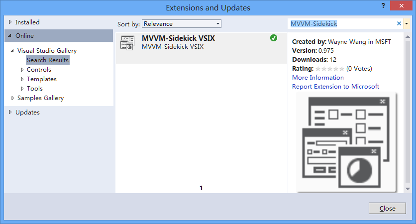
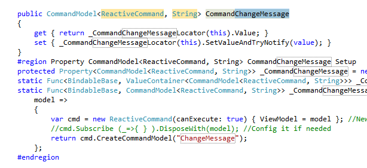

#Hello World! I am MVVM-Sidekick
> #跟班儿问世篇

##1.  Install VS Extension.
>##1.  安装模板包

MVVM-Sidekick VS Extension only supports VS2012 now.
>MVVM跟班儿的VS扩展目前只支持VS2012.

You can downloaded here.
>你可以在此下载

[[http://visualstudiogallery.msdn.microsoft.com/ef9b45cb-8f54-481a-b248-d5ad359ec407](http://visualstudiogallery.msdn.microsoft.com/ef9b45cb-8f54-481a-b248-d5ad359ec407 "http://visualstudiogallery.msdn.microsoft.com/ef9b45cb-8f54-481a-b248-d5ad359ec407")


If the link is outdated,  try search 'MVVM-Sidekick' on your 'Extensions and Updates' manager (TOOLS MENU).

> 如果链接失效,请尝试在你的VS2012工具菜单下的"扩展与更新"管理器中搜索"MVVM-Sidekick".




##2.  Create a new MVVM-Sidekick Project
>##2.   创建新跟班儿项目

After you install the VS extension, you can create a new MVVM-Sidekick project.
>安装过了模板扩展，你就可以创建新工程了

Now we support WP8, Silverlight 5, WPF 4.5 ,Windows Store platforms.
>目前我们支持 WP8 SL5 WPF 4.5 和 Windows Store


You can find our Project Template in each catalog we supported.
>在各个支持平台的分类中 你可以找到MVVM-Sidekick工程

And you can search 'MVVM' on the top-left Textbox.
>你也可以在右上角搜索MVVM


After you create this project, press F5, if your template works well, you may meet your Mainpage.

>按下F5 你就可以看到首页了


## 3. Add simple logic to View Model via code snippets.


####Code snippets is needed when you use MVVM－Sidekick.

> ####本框架需要代码块辅助开发


If  your "Documents" Folder is not in path "c:\", the nuget installation  might not working properly. Please install the snippet manually in `Tools->Code snippets` Menu. Default path is
 
`Packages/[MVVM-Sidekick Folder]/MVVM.snippet`


>如果你的“文档”文件夹不在默认安装的C:盘，有可能Nuget的自动安装可能不能正确的定位，需要您手动在 VS的`工具->代码片段` 中添加这个路径：

>`Packages/[MVVM跟班儿路径]/MVVM.snippet`

Supported snippets:

>支持如下常用代码块：

<table  border="3"  cellpadding="12" cellspacing="3" bordercolor="#aaaaaa">                                                                               
<tr><td>	propvm  </td><td>	New Propery In Model                                    </td><td>	在MVVMSidekick Binable/ViewModel 中增加属性</td>          </td> </tr>
<tr><td>	propcmd 	</td><td>	New Command In Model                                    </td> <td>	在MVVMSidekick Binable/ViewModel 中增加命令               </td>  </tr>
</table>


example:

	> propvm +tab +tab


####After you install the code snippet, you can add logic in your view model.
>####安装过代码块后，你就可以在 View Model 里面添加逻辑了。

- #####Add simple logic to View Model
	> 在 View Model 添加简单的逻辑
	- ######Add a Property	
		> ######添加一个属性 	
		- Open view model code file in folder `\ViewModels\`. 
			>打开`\ViewModels\`路径的VM代码文件。

			*Usually,  `MainPage_Model.cs` would be the default view model for the start up screen.*
			>*一般来说,  开始第一屏的VM代码是 `MainPage_Model.cs` .*	

		- Move you cursor into class `MainPage_Model` and input `propvm [tab] [tab]`
			> 将光标移动到 `MainPage_Model` 类中，输入`propvm [tab] [tab]`

		- Input property type `string` and tab again, then input property name `Message`.
			> 跟随着光标位置 输入 `string` 作为属性类型，然后输入属性名 `Message`
		
	

	- ######Add a Command	
		> ######添加一个命令 	
		
		- Input `propcmd [tab] [tab]` 
			> 输入 `propcmd [tab] [tab]` 
		- Input command name `CommandChangeMessage`
			> 输入命令名 `CommandChangeMessage`	
	

		- Remove the `//` comment before `cmd.Subscribe...`, then add code into as below.
			>移除代码中`cmd.Subscribe...`这一行的注释，修改为如下的内容


```csharp
	cmd.Subscribe(_ => { CastToCurrentType(model).Message = "Command is Invoked"; }).DisposeWith(model);
```


- #####Bind logic to controls
	>#####将逻辑绑定到控件


	- Open view file `MainPage.xaml` in designer.
	
	- Drag a Text Box control into view from tool box, adjust the position and size.

	- Locate `Text` in Property window, click the small square box over right, chose `Create Data binding`,select 

## 4.Create a new view.

MainPage.xaml is usually the default entrance in a XAML application.